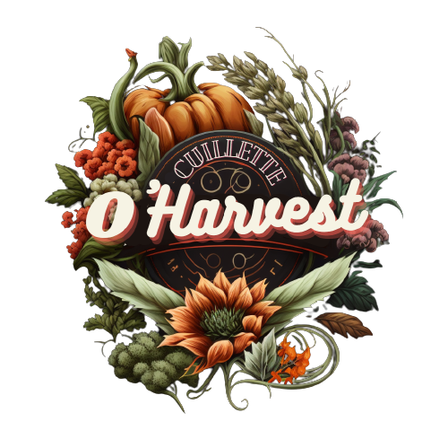

# O'HARVEST PROJECT (Front-end)

---
## Launch development server 

#### 1/ create .env.local file

```shell
cp .env .env.local
```

#### 2/ fill env variables in .env.local file

#### 3/ Start development server

```shell
#yarn
yarn dev

#npm
npm run dev
```

---
#### Activate the eslint config 

```shell
#yarn
yarn init @eslint/config


# with yarn
yarn
yarn dev
```

---

## Responsive format

---

#### Mobile width: 320px - 425px

```css
@media only screen and (max-width: 425px) {

}
```

#### Tablet width: 425px - 1024px

```css
@media only screen and (min-width: 425px) {

}
```

#### Desktop width: 1024px >

```css
@media only screen and (min-width: 1024px) {

}
```

## Working flow on a new feature

---

## Work on a new feature

Be placed on `dev` branch:

```
git checkout dev
git pull origin dev
```

Create a new branch to work on a new feature :
```
git checkout -b feat/feature-name>
```

## (!) Naming branch
❌ ~~CamelCase ou pascalCase~~
✅ **kebab-case**

## Commit convention:
- `config:` When configuration is changed
- `feat:` When adding new feature
- `fix:` When bug is resolved
- `doc:` When documentation is update
- `refacto:` When refactoring
- `style:` When adding or changing style
- `merge:` When two branch are merged
- `prod:` When website is deploy (merge dev into main)
- `hotfix:` When bug is resolved in production environment


Then explain in a few words the work done (mention the components/files on which you worked).

Once the conflicts are resolved, we make a pull request on **GitHub**, from the `feat/<feature-name>` branch in the `dev` branch.
Once the features have been collected in the `dev` branch and the bugs fixed,
we make a pull request on **GitHub**, from the `dev` branch in the `main` branch.
